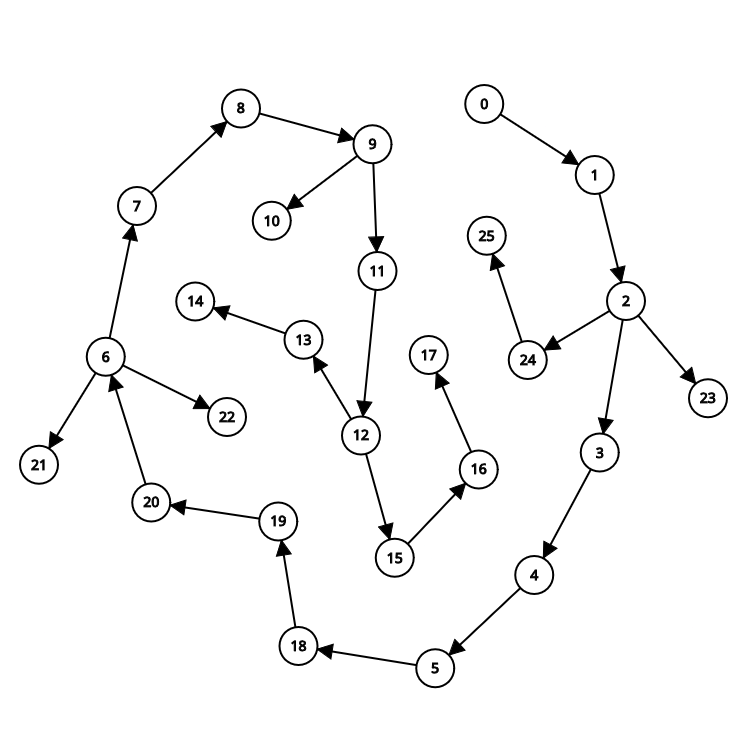

# 1. FPAA-trabalho-individual-03

O **Hamiltonian Path Finder** foi implementado em Rust e busca encontrar um caminho Hamiltoniano em um grafo representado por uma matriz de adjacência (`Vec<Vec<u8>>`). Esta solução demonstra os princípios de recursividade, backtracking, e uso seguro de memória em Rust.

## Como Executar o Projeto

3. Execute o projeto:
```bash
cargo run
```

4. A saída poderá ser:
```
Caminho Hamiltoniano encontrado: [0, 1, 2, 3]
```

5. Execute os testes:
```bash
cargo test
```

## Relatório Técnico

### Análise da Complexidade Assintótica

**Hamiltonian Path (Backtracking)** possui complexidade **O(n!)**, pois testa permutações possíveis para encontrar um caminho que visita todos os vértices exatamente uma vez.

1. **Caso base**:
   - Grafo com 0 vértices → retorna `None`
   - Grafo com 1 vértice → retorna `[0]`

2. **Recursão e Visita**:
   - Para cada vértice não visitado adjacente, o algoritmo tenta estender o caminho
   - Pior caso: todas as permutações testadas → O(n!)

3. **Melhor caso**:
   - Caminho Hamiltoniano é encontrado rapidamente

4. **Complexidade espacial**:
   - Vetor de visitados: O(n)
   - Caminho atual: O(n)
   - Pilha de chamadas recursivas: até O(n)

---

## Grafo:



## Tabela de Mapeamento (Hamiltonian Path - Rust)

| Vértice | Linha do Código                         | Instrução/Chamada                        |
|---------|------------------------------------------|------------------------------------------|
| 0       | `fn main()`                              | Início da execução                       |
| 1       | `let graph = vec![...]`                  | Declara matriz de adjacência             |
| 2       | `match hamiltonian_path(&graph)`         | Chama a função principal                 |
| 3       | `fn hamiltonian_path(...)`               | Início da função principal               |
| 4       | `let n = graph.len();`                   | Calcula número de vértices               |
| 5       | `let mut path = Vec::new();`             | Cria vetor para armazenar caminho        |
| 6       | `fn backtrack(...)`                      | Início da função recursiva               |
| 7       | `path.push(current);`                    | Adiciona vértice ao caminho              |
| 8       | `visited[current] = true;`               | Marca vértice como visitado              |
| 9       | `if path.len() == n`                     | Verifica se o caminho está completo      |
| 10      | `return true;`                           | Caminho completo encontrado              |
| 11      | `for neighbor in 0..n`                   | Loop pelos vizinhos                      |
| 12      | `if graph[current][neighbor] == 1 && ...`| Verifica se é adjacente e não visitado   |
| 13      | `if backtrack(...)`                      | Chamada recursiva                        |
| 14      | `return true;`                           | Propaga sucesso da recursão              |
| 15      | `path.pop();`                            | Desfaz última escolha (backtrack)        |
| 16      | `visited[current] = false;`              | Marca vértice como não visitado          |
| 17      | `false`                                  | Retorno de falha                         |
| 18      | `for start_vertex in 0..n`               | Tenta todos os vértices como início      |
| 19      | `let mut visited = vec![false; n];`      | Inicializa vetor de visitados            |
| 20      | `path.clear();`                          | Limpa caminho anterior                   |
| 21      | `return Some(path.clone());`             | Caminho Hamiltoniano encontrado          |
| 22      | `None`                                   | Nenhum caminho encontrado                |
| 23      | `Some(path) => println!(...)`            | Impressão do caminho encontrado          |
| 24      | `None => println!(...)`                  | Impressão de falha                       |
| 25      | Fim da execução                          | Fim do programa                          |

---

## Grafo (Representação do Fluxo)

```
0 1
1 2
2 3   
3 4   
4 5   
5 18  
18 19 
19 20 
20 6  
6 7   
7 8   
8 9   
9 10  
9 11  
11 12 
12 13 
13 14 
12 15 
15 16 
16 17 
6 21  
6 22  
2 23  
2 24  
24 25 
```